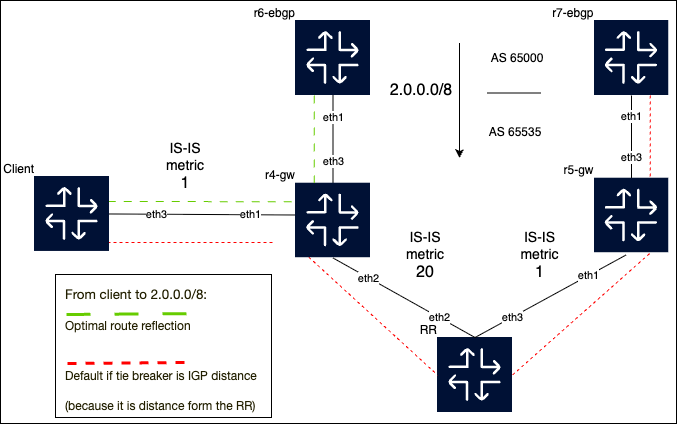

# ORR - Optimised route reflection

## Introduction

EOS lab to play with optimised route reflection, created using Containerlab.
The configurations are just for the purpose of lab testing, they are not hardened/etc...

## Network Topology



2.0.0.0/8 route received via two different eBGP peering points.

Left most router is the client, bottom is the route reflector.

From the route reflector perspective the tie breaker regarding the best path to reach 2.0.0.0/8 will be the IGP metric, so best route is via r5-gw, and when this route is reflected this will make the client router also prefer r5-gw as the exit point, which is clearly not ideal. 

## Optimising the route reflection
Ensure that route reflection considers the IGP metric from the client to the destination and not from the route reflector to the destination

At the route reflector (10.1.1.102 is the loopback of the client):
```bash
address-family ipv4
    neighbor 10.1.1.102 route-reflector-client optimal-route-reflection position peer-address
```


## Setup environment

1 - Setup was created using containerlab, to install it:

```bash
bash -c "$(curl -sL https://get.containerlab.dev)"
```

> [!WARNING]
> For MacOS installation, please refer to containerlab [website](https://containerlab.dev/install/)

1. Ensure Docker is installed and running on your system.
2. CEOS image
 * a. use the [EOS downloader](https://github.com/titom73/eos-downloader)
 * b. if you already have the image in your host you can simply import it into docker

```sh
$ docker import cEOS-lab-$EOS_VERSION.tar ceos:$EOS_VERSION
```

## Containerlab commands

Containerlab is used to deploy and manage the network topology for this project. To start the lab, run:
```sh
containerlab deploy -t topology.clab.yaml
```

To destroy the lab:

```sh
containerlab destroy -t topology.clab.yaml
```

### Credentials
- User: `admin` (no password)
- client	192.168.2.112
- rr	192.168.2.113
- r4-gw	192.168.2.114
- r5-gw	192.168.2.115
- r6-ebgp	192.168.2.221
- r7-ebgp	192.168.2.222
